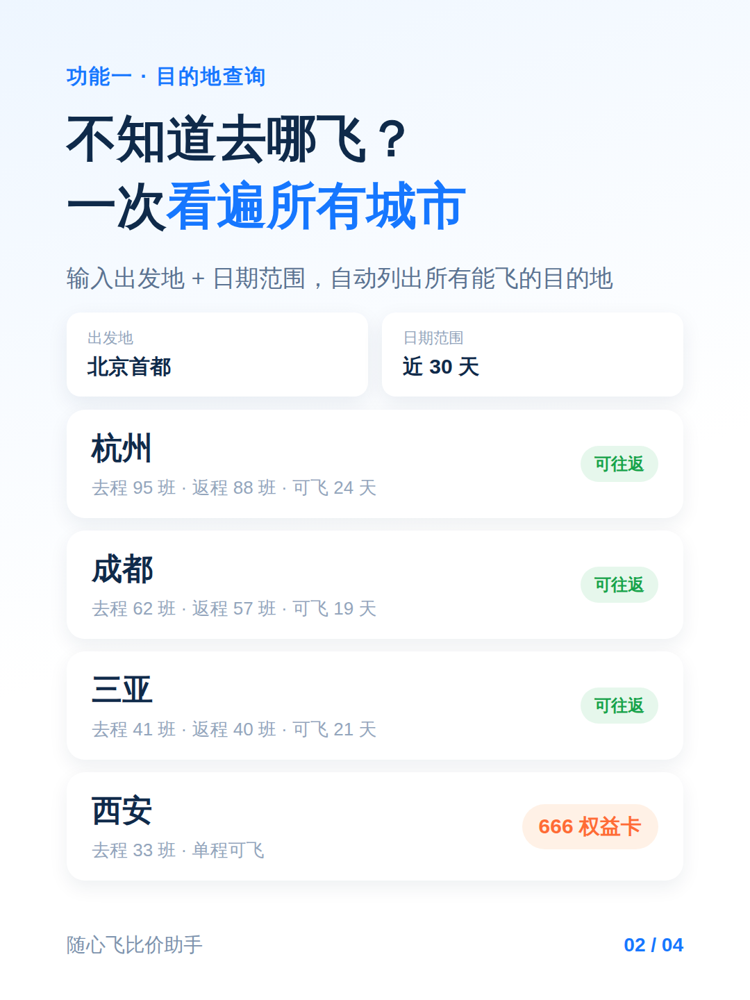
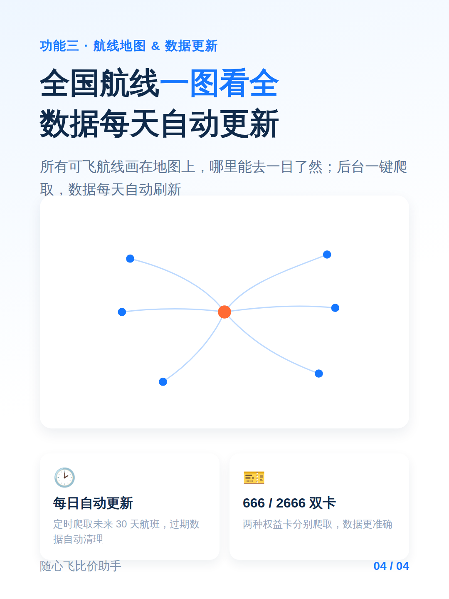

# 小红书图文预览

> 本文件仅用于 GitHub 内预览效果，非小红书正式文案（正式文案见 [copy.md](./copy.md)）。

## 封面

## 功能一 · 目的地查询

## 功能二 · 智能行程规划

## 功能三 · 航线地图 & 数据更新

---

## 文案

### 标题（二选一）

1. 随心飞不知道去哪？我自己写了个工具帮全解决 ✈️
2. 666/2666 权益卡怎么飞最划算？一个工具全搞定

### 正文

姐妹们！海航随心飞的 666/2666 权益卡真的是薅羊毛神器，但每次想飞之前都要一个个城市试、一个个日期查，太费时间了😭

作为一个程序员，我受不了了，直接自己写了个小工具，专治"不知道去哪飞、不知道怎么飞最划算"👇

✅ **目的地查询**
输入出发地 + 日期范围，一键看遍所有能特价飞到的城市，去程/返程航班数、可飞日期一目了然，还会标出"可往返"的目的地，不用来回切页面查。

✅ **智能行程规划**
输入起点终点和出发日期，自动帮你排出 Top 10 最优路线，综合考虑价格、总耗时、中转次数，中转城市、候机时间都算好了，不用自己拿计算器算。

✅ **全国航线地图**
所有能飞的航线画在地图上，哪里能去一目了然，选目的地跟连连看似的，直观又好玩🗺️

✅ **数据自动更新**
后台一键爬取，数据每天自动刷新，不用担心航班信息过期。

个人小项目，纯自用向，写给同样在玩随心飞的姐妹们，希望能帮大家省点时间去多飞几个地方～

有想一起交流薅羊毛路线的评论区扣1！

### 话题标签

\#随心飞 \#海南航空随心飞 \#666权益卡 \#2666权益卡 \#机票攻略 \#薅羊毛 \#穷游攻略 \#程序员搞副业 \#自己动手做工具 \#国内旅行攻略
